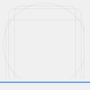
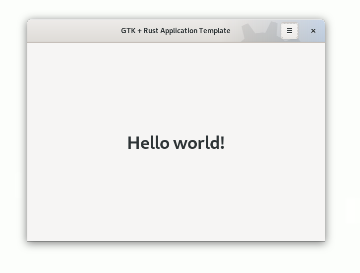

<!-- FIXME Uncomment once published at Flathub -->
<!-- <a href="https://flathub.org/apps/details/me.amypoon.AlterEgoTools"> -->
<!--  -->
<!-- </a> -->

# Alter Ego Tools

<!-- FIXME Set project description -->

Write a GTK + Rust summary

## Screenshots

## Hack on Alter Ego Tools

To build the development version of Bustle and hack on the code
see the [general guide](https://developer.gnome.org/documentation/tutorials/beginners/getting_started.html)
for building GNOME apps with Flatpak and GNOME Builder.

<!-- FIXME Uncomment once available at Damned Lies -->
<!-- ## Translations -->

<!-- Helping to translate Alter Ego Tools or add support to a new language is very -->
<!-- welcome. You can find everything you need at: -->
<!-- [l10n.gnome.org/module/alter-ego-tools/](https://l10n.gnome.org/module/alter-ego-tools/) -->

## Code Of Conduct

This project follows the [GNOME Code of Conduct](https://conduct.gnome.org/).
