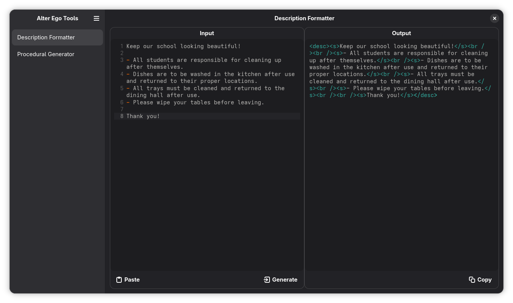
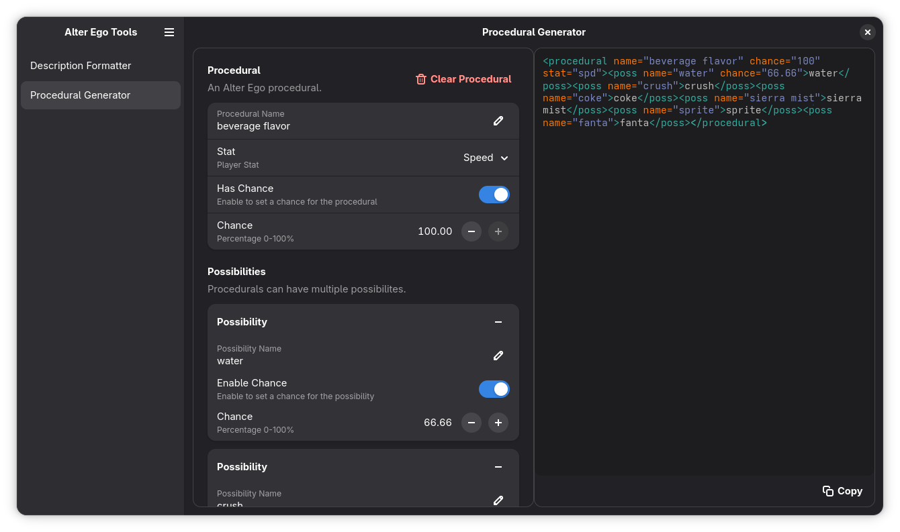

<!--
SPDX-FileCopyrightText: 2026 Amy Poon <amy@amypoon.me>

SPDX-License-Identifier: GPL-3.0-or-later
-->

# Alter Ego Tools

Tools for [Alter Ego](https://github.com/MsVBLANK/Alter-Ego) moderators.

Alter Ego Tools provides a set of utilities to help moderators of Alter Ego, an open-source Discord bot that facilitates an in-depth, multiplayer text adventure role-playing game.

## Features

### Description Formatter

Converts plain text into Alter Ego XML descriptions.



### Procedural Generator

Creates Alter Ego procedurals and containing phrases. Supports having an arbitrary amount of possibilities with chances
for each one.
Includes syntax highlighting for Alter Ego possible names.



## Installation

### System Requirements

Any x86-64 system running a modern Linux distribution with Flatpak support.

### Installing with Flatpak

Make sure that your system has [Flatpak](https://flatpak.org/) installed, then run the following command to install
Alter Ego Tools.

```sh
flatpak install https://dl.flufflesamy.com/repo/appstream/com.flufflesamy.AlterEgoTools.flatpakref
```

### Updating

To update Alter Ego Tools, use Flatpak's update command:

```sh
flatpak update
```

<!--Make sure that your system has [Flatpak](https://flatpak.org/) installed, then
download the Alter Ego flatpak bundle from [GitHub Releases](https://github.com/flufflesamy/alter-ego-tools/releases/latest), then install with the following command:

```sh
# Replace [VERSION] with the actual version number
flatpak install alter-ego-tools-[VERSION].flatpak
```-->

### Uninstalling

To uninstall Alter Ego Tools and remove its Flatpak repo, run the following command.

```sh
flatpak uninstall com.flufflesamy.AlterEgoTools
flatpak remote-remove flufflesamy
```

<!--```sh
flatpak uninstall com.flufflesamy.AlterEgoTools
```-->

## Building

### Building with Flatpak + GNOME Builder

To build the development version of Alter Ego Tools and hack on the code
see the [general guide](https://developer.gnome.org/documentation/tutorials/beginners/getting_started.html)
for building GNOME apps with Flatpak and GNOME Builder.

## License

Alter Ego Tools

Copyright (C) 2026 Amy Poon

This program is free software: you can redistribute it and/or modify
it under the terms of the GNU General Public License as published by
the Free Software Foundation, either version 3 of the License, or
(at your option) any later version.

This program is distributed in the hope that it will be useful,
but WITHOUT ANY WARRANTY; without even the implied warranty of
MERCHANTABILITY or FITNESS FOR A PARTICULAR PURPOSE.  See the
GNU General Public License for more details.

You should have received a copy of the GNU General Public License
along with this program.  If not, see <https://www.gnu.org/licenses/>.
